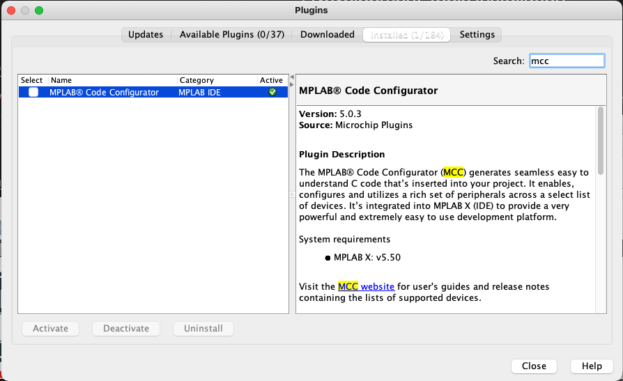

# Development Tools Installation

## 1. Install the Microchip `MPLAB X` Tool Chain

- Download/install the latest version of the [MPLAB X IDE](https://www.microchip.com/mplab/mplab-x-ide)

- Download/install [MPLAB XC16 Compiler v1.70 or later](https://www.microchip.com/en-us/development-tools-tools-and-software/mplab-xc-compilers#tabs)

- Install `MPLAB Code Configurator` 3.95 or later (launch MPLAB X IDE > click on `Tools` > `Plugins Download` > search for `MPLAB Code Configurator` and install it)

    

## 2. Install [Git](https://git-scm.com)

- Download/install the latest version of [Git for Windows](https://git-scm.com/download/win)
- Verify that you have access to `Git Bash` (click `Start` > type `Git Bash`)

    

## 3. Download the Microchip [IoT Provisioning Tool](https://www.microchip.com/design-centers/internet-of-things/iot-dev-kits/iot-provision-tool)

   - Connect the Microchip IoT Development Board to the Host PC using a standard micro-USB cable
   - Launch `PowerShell` (click on `Start` > type `PowerShell` in the Search field > `Open`)
   - Using the command line, go to the directory where the `iotprovision-bin` executable file resides (`\iotprovision-bin-1\windows64\`)
   - Execute the command

        ```shell
        .\iotprovision-bin.exe -c azure -m custom
        ```
