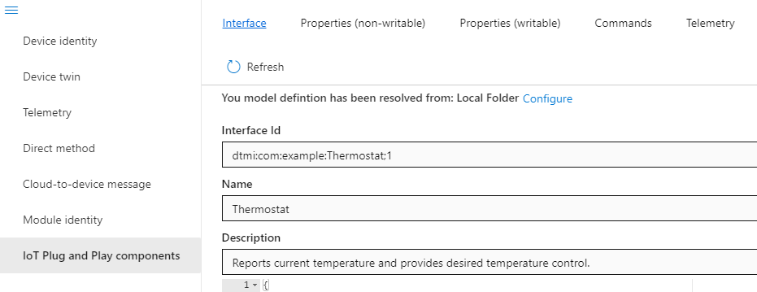

# Repurpose PIC-IoT Wx Development Board to Connect to Azure through IoT Hub Device Provisioning Service (DPS)

## Introduction

 This document describes how to connect the PIC-IoT Wx Development Board (featuring a 16-bit PIC24F MCU, ATECC608A secure element, and ATWINC1510 Wi-Fi module) to an Azure IoT Hub via Device Provisioning Service (DPS) while leveraging Microsoft’s Azure IoT Embedded C SDK. The PIC-IoT is provisioned for use with Azure using self-signed X.509 certificate-based authentication.


## Table of Contents

- [Repurpose PIC-IoT Wx Development Board to Connect to Azure through IoT Hub Device Provisioning Service (DPS)](#repurpose-pic-iot-wx-development-board-to-connect-to-azure-through-iot-hub-device-provisioning-service-dps)
  - [Introduction](#introduction)
  - [Table of Contents](#table-of-contents)
  - [Background Knowledge](#background-knowledge)
    - [PIC-IoT Wx Development Board Overview & Features (SMART \| CONNECTED \| SECURE)](#pic-iot-wx-development-board-overview--features-smart--connected--secure)
    - [Microchip “Provisioning” vs. Microsoft “Provisioning”](#microchip-provisioning-vs-microsoft-provisioning)
    - [High Level Architecture between the Client (PIC-IoT) and the Cloud (Azure)](#high-level-architecture-between-the-client-pic-iot-and-the-cloud-azure)
    - [Azure IoT Embedded C SDK](#azure-iot-embedded-c-sdk)
    - [TLS connection](#tls-connection)
    - [MQTT Connection](#mqtt-connection)
  - [Sample Descriptions](#sample-descriptions)
    - [AzureIotDps.X](#azureiotdpsx)
    - [AzureIotPnpDps.X](#azureiotpnpdpsx)
  - [Checklist](#checklist)
  - [Prerequisites](#prerequisites)
    - [Step 1: Set up Microchip’s MPLAB X IDE Tool Chain](#step-1-set-up-microchips-mplab-x-ide-tool-chain)
    - [2. Set up Azure cloud resources](#2-set-up-azure-cloud-resources)
    - [3. Set up Git](#3-set-up-git)
  - [Step 2: Prepare your PIC-IoT board to connect to Azure](#step-2-prepare-your-pic-iot-board-to-connect-to-azure)
  - [Step 3: Enroll device into DPS](#step-3-enroll-device-into-dps)
    - [1. Preparing your environment for the certification verifying process:](#1-preparing-your-environment-for-the-certification-verifying-process)
    - [2. In Azure portal, upload the root CA cert “root-ca.pem” in DPS and do proof-of-possession for X.509 CA certificates with your Device Provisioning Service](#2-in-azure-portal-upload-the-root-ca-cert-root-capem-in-dps-and-do-proof-of-possession-for-x509-ca-certificates-with-your-device-provisioning-service)
    - [3. Add a new enrollment group using the signer-ca.pem file](#3-add-a-new-enrollment-group-using-the-signer-capem-file)
    - [STOP! Sanity checks:](#stop-sanity-checks)
  - [Step 4: Connect the PIC-IoT device to Azure](#step-4-connect-the-pic-iot-device-to-azure)
  - [Step 5: Verify the connection between PIC-IoT and Azure](#step-5-verify-the-connection-between-pic-iot-and-azure)
  - [Step 6: View PIC-IoT board telemetry on Azure IoT Explorer](#step-6-view-pic-iot-board-telemetry-on-azure-iot-explorer)
    - [Further instructions for IoT Plug and Play](#further-instructions-for-iot-plug-and-play)
  - [Further consideration](#further-consideration)
  - [Conclusion](#conclusion)
  - [Support](#support)

## Background Knowledge

### PIC-IoT Wx Development Board Overview & Features (SMART \| CONNECTED \| SECURE)


 Download the [PIC-IoT Wx HW User Guide](http://ww1.microchip.com/downloads/en/DeviceDoc/PIC-IoT-Wx-Hardware-User-Guide-DS50002964A.pdf) for more details

### Microchip “Provisioning” vs. Microsoft “Provisioning”

The term “provisioning” will be use throughout this document (e.g. IoT
Provisioning Tool, provisioning key, provisioning device, device
provisioning service, etc.). On the Microchip side, the provisioning
process is to securely inject certificates into the hardware. From the
context of Microsoft, provisioning is defined in the relationship
between the hardware and the cloud, Azure. [Azure IoT Hub Device
Provisioning Service
(DPS)](https://docs.microsoft.com/en-us/azure/iot-dps/#:~:text=The%20IoT%20Hub%20Device%20Provisioning%20Service%20%28DPS%29%20is,of%20devices%20in%20a%20secure%20and%20scalable%20manner.)
allows the hardware to be provisioned securely to the right IoT Hub.


### High Level Architecture between the Client (PIC-IoT) and the Cloud (Azure)

This high-level architecture description summarizes the interactions
between the PIC-IoT board and Azure. These are the top six major puzzle
pieces that make up this enablement work of connecting PIC-IoT to Azure
through DPS using X.509-based authentication:

- ATECC608A: a secure element from the Microchip CryptoAuthentication
    portfolio. It securely stores a private key that is used to
    authenticate the hardware with cloud providers to uniquely identify
    every board <https://www.microchip.com/wwwproducts/en/ATECC608A>

- ATWINC1510: a low-power consumption Wi-Fi module that has access to
    the device certificate, signer CA certificate, and public key for
    mutual TLS handshaking between the board and the cloud
    <https://www.microchip.com/wwwproducts/en/ATWINC1510>

- IoT Provisioning Tool: Microchip-provided tool for provisioning
    self-signed certificate utilizing the unique serial number and
    private key stored in the ATECC608A secure element.

- Azure IoT Embedded C SDK: Microsoft-provided API designed to
    allow small, low-cost embedded IoT devices to communicate with Azure
    services, serving as translation logic between the application code
    and transport client

- Azure IoT Hub: IoT Hub is a managed service, hosted in the cloud,
    that acts as a central message hub for bi-directional communication
    between your IoT application and the devices it manages

- Device Provisioning Service (DPS): a helper service for IoT Hub that
    enables zero-touch, just-in-time provisioning to the right IoT hub
    without requiring human intervention, allowing customers to
    provision millions of devices in a secure and scalable manner

 

In a nutshell, we will use Microchip’s IoT Provisioning Tool to send a
Certificate Signing Request (CSR) to the ATECC608A to generate a
self-signed certificate chain which is then obtained by the ATWINC1510
Wi-Fi module to perform a TLS mutual handshake between the client
(PIC-IoT board) and the server (Azure), specifically using DPS.

Once successful, the PIC-IoT board will be provisioned to the correct
IoT Hub that is pre-linked to DPS during the setup process. We can then
leverage the Azure IoT Explorer which is a graphical tool for
interacting with and testing your IoT devices. Note that the ATECC608A
only contains the private key. The self-signed certificate chain
including root CA, signer CA (or intermediate CA), and device CA is
stored in the ATWINC1510 Wi-Fi module used for the TLS handshake.

### Azure IoT Embedded C SDK

This is the high-level view of the Embedded C SDK which translates the application code into an Azure-friendly logic that can be easily understood by Azure IoT Hub. Note that Microsoft is only responsible for the logic in the green box; it is up to the IoT Developer to provide the remaining layers of application code, Transport Client, TLS, and Socket. In the provided demo project, Microchip provides the layers in blue. Please the [Azure SDK for Embedded C](https://github.com/Azure/azure-sdk-for-c/tree/78a280b7160201cf10a106e8499e03eec88ea582) document for more details.


### TLS connection

The TLS connection performs both authentication and encryption.
Authentication consists of two parts:

- Server authentication; the board authenticates the server
- Client authentication; the server authenticates the board

Server authentication happens transparently to the user since the
ATWINC1510 on the PIC-IoT board comes preloaded with the required CA
certificate. During client authentication the client private key must be
used, but since this is stored inside the ATECC608A chip and cannot be extracted, all calculations must be done inside the ATECC608A. The ATWINC1510 library offers an API to delegate the TLS calculations to the main application. The main
application will in turn call the ATECC608A library API’s to perform the
calculations. Before the TLS connection is complete, a shared secret key
must be negotiated between the server and the client. This key is used
to encrypt all future communications during the connection.

### MQTT Connection

After successfully connecting on the TLS level, the board starts
establishing the MQTT connection. Since the TLS handles authentication
and security, MQTT does not have to provide a username or password.


## Sample Descriptions

Currently we have two samples to use with the PIC-IoT-Wx. The first one is using DPS to provision and then connects and interacts with IoT Hub using unprocessed application code. The second one is using DPS to provision and then connects and interacts with IoT Hub using the IoT Plug and Plug programming model. To further understand what IoT Plug and Play is, please see the documentation [here](https://docs.microsoft.com/en-us/azure/iot-pnp/overview-iot-plug-and-play). Both samples use the same setup process, differing only slightly in how you interact with them with the IoT Explorer.

### AzureIotDps.X

Connect the device through Azure IoT Hub Device Provisioning to then connect to your IoT Hub. Use the IoT Explorer to view the telemetry as it is received by the service.

### AzureIotPnpDps.X

Use an IoT Plug and Play enabled device with the DTMI detailed [here](https://github.com/Azure/opendigitaltwins-dtdl/blob/master/DTDL/v2/samples/Thermostat.json).
You can monitor the telemetry, invoke methods, and modify properties easily with the additional instructions listed at [here](#further-instructions-for-iot-plug-and-play).



## Checklist

Here are major steps of this project. Track your progress using this
list as you complete each stage:


## Prerequisites

Prepare your development environment

- [Setup your Azure IoT hub](https://github.com/Azure/azure-iot-device-ecosystem/blob/master/setup_iothub.md)
- [Azure IoT Explorer](https://github.com/Azure/azure-iot-explorer/releases)
- For the IoT Plug and Play sample, download the IoT Plug and Play DTMI [here](https://github.com/Azure/opendigitaltwins-dtdl/blob/master/DTDL/v2/samples/Thermostat.json)
- [MPLAB X IDE V5.30 or later](https://www.microchip.com/mplab/mplab-x-ide)
- [XC16 Compiler v1.50 or later](https://www.microchip.com/mplab/compilers)

### Step 1: Set up Microchip’s MPLAB X IDE Tool Chain

- [MPLAB X IDE V5.30 or
    later](https://www.microchip.com/mplab/mplab-x-ide)

- [XC16 Compiler v1.50 or
    later](https://www.microchip.com/mplab/compilers)

- MPLAB Code Configurator 3.95 or later (once you finish the
    installation of the previous items, launch MPLAB X IDE &gt; click on
    Tools &gt; Plugins Download &gt; search for MPLAB Code Configurator
    and install it)

    

### 2. Set up Azure cloud resources

- [Create an Azure free account for 30 day
    trial](https://azure.microsoft.com/en-us/free/)    
    As a result, you should be able to access to Azure Portal by the end of this step.

- [Set up Azure IoT Hub and Device Provisioning Service (DPS) in Azure
    Portal](https://docs.microsoft.com/en-us/azure/iot-dps/quick-setup-auto-provision)    
    As a result, you should be able to create 1) an IoT Hub, 2) a  Device Provisioning Service and 3) have your DPS linked to your IoT Hub. 

-  [Install Azure IoT Explorer](https://docs.microsoft.com/en-us/azure/iot-pnp/howto-install-iot-explorer#install-azure-iot-explorer) (make sure to download \*.msi file of the release 0.12.1 or later). The Azure IoT explorer is a graphical tool for interacting with and testing your IoT device on Azure. View [this document](https://docs.microsoft.com/en-us/azure/iot-pnp/howto-install-iot-explorer#install-azure-iot-explorer) for more details.

### 3. Set up Git

- Install latest version of [Git](https://git-scm.com/download/win)
- Verify that you have accessed to Git Bash by going to Start menu > type "Git Bash", a window like this will pop-out: 

    


Step 2: Prepare your PIC-IoT board to connect to Azure
-----------------------------------------------------------
This step serves two purposes:

1. Update the internal firmware of the ATWINC1510 Wi-Fi module on the PIC-IoT to enable mutual TLS handshake between client’s ECC and server’s RSA. 

2. Provision the PIC-IoT board by securely inject certificates into the hardware. Perform this section to create a self-signed certificate chain which acts as a device unique ID to enroll into DPS. The final result is the ATWINC1510 obtains the device certificate, CA certificate, and CA public key. The device certificate is based on a key pair that has previously been generated and is already pre-programmed in the ATECC608A. The device certificate is the client certificate used by the TLS layer for the client authentication (“device” and “client” are used interchangeably in this document). The end goals of the provisioning process include the following:
    - The PC running the Python script requests and receives a Certificate Signing Request (CSR) based on the key pair stored in the ATECC608A
    - The signer CA generates the certificate and returns it alongside with its own certificate and public key to the MCU; the two (signer and device) certificates are stored in the ATWINC1510


Here are the steps:

1. Download the [Microchip provisioning tool v1.4](http://www.microchip.com/mymicrochip/filehandler.aspx?ddocname=en1001525)

2. Unzip the downloaded folder and follow the instruction in the README.txt file to perform WINC FW upgrade and board provisioning.
3. Take note of the generated cert location mentioned in the output message starting with “Saving to your …[your path]\.microchip-iot\MCHP3261021800001185.”. These certs will be used in IoT Hub DPS enrollment in the next step:
    * root-ca.crt (or .key): self-signed root CA cert
    * signer-ca.crt (or .key) (aka. intermediate CA) is a uniquely generated by the root cert, which is then used to generate device cert in [your-path]\.microchip-iot\MCHP<xxxxxxxxxxxxxxxx>\device.crt


 **STOP! Knowledge backfill:** to understand the steps approaching
in the upcoming session, please take some time review the document
[Conceptual understanding of X.509 CA certificates in the IoT
industry](https://docs.microsoft.com/en-us/azure/iot-hub/iot-hub-x509ca-concept)
which describes the value of using X.509 certificate authority (CA)
certificates in IoT device manufacturing and authentication to IoT
Hub.


Step 3: Enroll device into DPS 
----------------------

### 1. Preparing your environment for the certification verifying process:

- Go to generated cert location in the previous step at `\[your
    path]\.microchip-iot`

- Copy `*.crt` files and rename them to `*.pem`. (Note: DPS only accepts
    \*.pem or \*.cer file formats. If choosing \*.cer file, only base-64
    encoded certificate)

### 2. In Azure portal, upload the root CA cert “root-ca.pem” in DPS and do proof-of-possession for X.509 CA certificates with your Device Provisioning Service

#### a. Register the public part of an X.509 certificate and get a verification code
Follow the “Register the public part of an X.509 certificate and get a verification code” section in [this document](https://docs.microsoft.com/en-us/azure/iot-dps/how-to-verify-certificates).
Again, the verification code is generated by encrypting the public key
portion of your X.509 certification. It will be used to validate the
uploaded certificate ownership. So make sure to copy the generated
verification code to notepad for next step.

#### b. Digitally sign the verification code to create a verification certificate

 Now that you've registered your root CA with Azure IoT Hub, you'll
need to prove that you actually own it by:

1.  Generating the Certificate Signing Request (CSR) using the
    verification code.
2.  Generating a verification certificate using CSR above

Once this done, you can upload your verification certificate to DPS to finish the [proof of possession](https://tools.ietf.org/html/rfc5280#section-3.1).

Here are the steps:

1. Open the Git Bash: Start menu &gt; type “Git Bash”, a window like this will pop out:

    

2. Change to your generated certification folder:

    ```bash
    cd drive\[your path\.microchip-iot

    Example: cd /C/Users/john5/Azure/.microchip-iot
    ```

3. **Generate a certification signing request (CSR)** by entering the below command. CSR is generated by encrypting these two key inputs:

      * The `root-ca.key` generated in previous step by Microchip IoT Provisioning tool. This will be used in the openssl command line below.
     * The `Verification Code` generated from DPS in previous step. You will be asked to provide this during the process of creating the CSR.

    **Note**: Once you enter to command below, you will then be asked to enter information that will be used to will be incorporated into your certificate request. Enter verification code (generated from Azure portal) when prompt for CommonName. For the rest, you can enter anything you want.

    ```bash 
    openssl req -new -key root-ca.key -out azure_root_ca_verification.csr
    ```

    As the result, you should see this file `azure_root_ca_verification.csr` in your \\.microchip-iot folder like so: 

    
>


4. Generate a verification certificate by entering the following.

    ``` 
    openssl x509 -req -in azure\_root\_ca\_verification.csr -CA root-ca.crt -CAkey root-ca.key -CAcreateserial -out azure\_signer\_verification.cer -days 365 -sha256
    ```
    As the result, you should see this file `azure_root_ca_verification.cer` in your \\.microchip-iot folder.

    


#### c. Upload the signed verification certificate to DPS

Follow the “Upload the signed verification certificate” section in
[this document](https://docs.microsoft.com/en-us/azure/iot-dps/how-to-verify-certificates). As a result, the status of your uploaded certification should be “Verified” as shown below (make sure to refresh the page to see the updated change in status). 


#### STOP! Quick summary of this step

By now, you have done verifying your X.509 CA certificate to DPS. To link all the above sub-steps and understand why this step is significant, I encouraged you to quickly re-visit a few introduction paragraphs of [this document](https://docs.microsoft.com/en-us/azure/iot-dps/how-to-verify-certificates).

### 3. Add a new enrollment group using the signer-ca.pem file

1. In the Azure portal, navigate to your DPS &gt; Manage enrollments &gt;
Select “Enrollment Groups” tab:

    

2. Add enrollment group &gt; Enter “Group name” &gt; Choose Certificate
as “Attestation Type” &gt; Choose “False” for IoT Edge Device &gt;
Choose “Intermediate Certificate” as Certificate Type &gt; Upload
\[path]\.microchip-iot\signer-ca.pem to Primary Certificate &gt;
select “Evenly weighted distribution” for how you want to assign
devices to hub &gt; select your IoT Hub that this new enrollment group
can assign to &gt; leave the rest as their existing defaults &gt; hit
“Save”.

    Once this has been done, your enrollment group name should show up in
    the Enrollment Groups tab:

    

### STOP! Sanity checks:

At this point, you have successfully created an enrollment group in DPS. However, as we have not yet programmed the PIC-IoT board with
the demo firmware, the device should not show up anywhere in Azure.
This can be verified in both DPS and in IoT Hub.

1. In your DPS, Enrollment Group’s Registration Records should be empty.
This can be verified by clicking on your newly enrolled group &gt;
Registration Records &gt; observe that no device shows up

3. In your IoT Hub, your device ID should not show up in the IoT Devices.
This can be verified by clicking on your IoT Hub that links to your
DPS &gt; click “IoT devices” (on the left-hand side under “Explorers”
&gt; observe that your PIC-IoT device ID “sn01237F696BEB9C89FE” does
not show up.

Step 4: Connect the PIC-IoT device to Azure
-----------------------------------
In this step, we will flash the PIC-IoT board and connect it to Azure.

1. Create a local folder to check out (clone) the MPLAB X demo project
    by issuing the following commands in a Command Prompt or PowerShell
    window:
    ```
    git clone https://github.com/jasmineymlo/Microchip-PIC-MCU16-AzureIoT
    cd Microchip-PIC-MCU16-AzureIoT
    git checkout –t origin/wip
    git submodule update --init
    ``` 

2.  Launch the MPLAB X IDE and then open the demo project (\*.X) located
    at:
    
    \[path\]\\Microchip-PIC-MCU16-AzureIoT\\myiot.X

    Ignore the following warning messages that may show up in the Output
    window after the project has been loaded: 

    

3. Modify `myiot/Header Files/platform/config/conf_winc.h` with your
    wireless router’s SSID and password:
    ```c
    #define CFG_MAIN_WLAN_SSID "Your SSID"
    #define CFG_MAIN_WLAN_PSK  "Your WiFi Password"
    ```

4.  Modify `myiot/Header Files/platform/config/IoT_Sensor_Node_config.h` with your DPS ID Scope and comment out the Hub Device ID:

    - Comment out the definition for HUB\_DEVICE\_ID
        ```c
        //#define HUB_DEVICE_ID "01233EAD58E86797FE"
        ```
     - Update PROVISIONING\_ID\_SCOPE by copying the ID number directly from the Azure Portal
  
        

        ```
        #define PROVISIONING_ID_SCOPE "0ne00xxxxxx"
        ```


5.  Modify `myiot\Source Files\platform\application_manager.c` to set
    the highest severity debug level:

    - Locate this line of code:
        ```
        debug_init(attDeviceID)
        ```
    - Add the this function call right below the debug_init call. 
        ```
        `debug\_setSeverity(SEVERITY\_DEBUG)`  
        ``` 
        This line is added for debugging purpose.  By default the debug level is set to only output when there is error. The result looks like this:

        

6.  Verify the project properties are set correctly before building the
    project:

    -   Connect the board to PC, make sure “CURIOSITY” device shows up as a
    disk drive in a File Explorer window.

    -   Right-click the project myiot &gt; select “Properties” &gt; Verify
    that all Configuration settings are at least the minimum versions as
    shown in the below screenshot (and that your PIC-IoT board is
    selected as the Connected Hardware Tool). If any changes were made,
    make sure to hit the “Apply” button before hitting “OK”.

        

7. Build the project and program the device to connect to Azure with
    the following steps:

    -   Open a serial terminal (e.g. PuTTY or TeraTerm) and connect to the board at 9600 baud to view debug/status messages (open PuTTY Configuration window &gt; choose “session” &gt; choose “Serial”&gt; Enter the right COMx port). You can find the COM info by opening your PC’s Device Manager &gt; expand Ports(COM & LPT) &gt; take note of Curiosity Virtual COM Port. 

        

    -   Right-click the myiot project and select “Set as Main Project”

    -   Right-click the myiot project and select “Make and Program Device”. This will first automatically clean and build the project. After the “BUILD SUCCESSFUL” message appears in the Output window, the application HEX file will be programmed onto the PIC-IoT board. Once programming has finished, the board will automatically reset and start running its application code. After a few seconds, you can check if the PIC-IoT board has successfully connected to your Wi-Fi Access Point by observing 3 colored LED’s on the board:

        -   BLUE: Solid ON all the time (WIFI)
        -   GREEN: Solid ON all the time (COMM)
        -   RED: Toggling every few seconds (DATA)

Step 5: Verify the connection between PIC-IoT and Azure
-----------------------------------------------

PIC-IoT and Azure connection can be verified by different ways:
1) View debug log messages in the serial terminal
2) Correct device ID shows up in DPS enrollment that was created earlier
3) Correct device ID shows up in the IoT Hub

Here are the steps:

1. Verify in the serial terminal window (e.g. PuTTY or TeraTerm). You
    may need to enable “Local Echo” in your Terminal settings to see
    your keystrokes displayed in the terminal window.

   - Once the PIC-IoT has established a successful connection, continuous
    MQTT messages involving “sendresult” and “Uptime SocketState” will
    be displayed on the terminal window
        ```
        sn01237F696BEB9C89FE" DEBUG NORMAL MQTT: sendresult (83)
        sn01237F696BEB9C89FE" INFO NORMAL CLOUD: Uptime 2315s SocketState (3) MQTT (3)
        ```
   - Try disabling the status messages now by typing “debug 0” +
    \[ENTER\]

   - Hit \[ENTER\] on the terminal window; a list of available commands
    will show up

   - Type “device” and \[ENTER\] to verify that the correct device ID is
    displayed (e.g. sn01237F696BEB9C89FE)

   - Type “debug 4” and \[ENTER\] and observe that the MQTT messages are
    being transmitted/received again


2. Verify in the Azure Device Provisioning Service

    - In Azure Portal, go to your DPS &gt; click “Manage enrollments” &gt; under Enrollment Group, click “your group name” &gt; click “Registration Records” &gt; device should show up with the IoT Hub info that it got assigned to. Like so:

        

3. In the Azure Portal, go to your IoT Hub &gt; click “IoT
    Devices” &gt; click “Refresh” &gt; device should show up with the
    Status “Enabled” and Authentication Type of “SelfSigned”

    

Step 6: View PIC-IoT board telemetry on Azure IoT Explorer
--------------------------------------------------

 Once the PIC-IoT connection to Azure has been verified in the previous step, the telemetry can be monitored by taking advantage of Azure IoT Explorer. The Azure IoT explorer is a graphical tool for interacting with and testing your IoT device on Azure. View [this document](https://docs.microsoft.com/en-us/azure/iot-pnp/howto-install-iot-explorer#install-azure-iot-explorer) for more details.
 

  1. Connect Azure IoT Explorer to IoT Hub by providing IoT Hub’s
    connection string. From the Azure Portal: click on your IoT Hub &gt;
    Shared access polices &gt; iothubowner &gt; connection
    string-primary key &gt; Copy to clipboard

        

  2. Launch Azure IoT Explorer: Click on “Add connection” &gt; paste the
    Connection String &gt; Save

        

        

  3. Once the IoT Hub connection has been added, the list of devices
    connected to the hub appears. Verify that the correct PIC-IoT serial
    number is displayed, and then click on it:

        

  4. Verify that the IoT Hub can send a command to the device. In the
    device window:

        Click Direct method tab &gt; enter “blink” in Method name &gt; enter {"duration":10} for payload &gt; Invoke method (a pop-up message displaying ERROR will appear, but that is expected since the IoT Hub is sending a simulated error condition to the PIC-IoT board). Observe that the RED LED stays on for 10 seconds.

        

1. Monitor telemetry sending from PIC-IoT to Azure IoT Hub. 
   
   In the device window: Click Telemetry tab &gt; Start: after about 2 minutes, observe telemetry data is being updated in real-time approximately every 5s. 
   
    
    

### Further instructions for IoT Plug and Play

- Once you open the tool, on the left side, there should be a tab called "IoT Plug and Play Settings". Open that tab and add the directory where you downloaded the DTMI detailed from [prerequisites](#prerequisites).
- Paste in the connection string for your IoT Hub from the portal.
- Find your device listed after clicking on your newly connected IoT Hub and navigate to the left hand side where you will find a "IoT Plug and Play components" tab.
- There, click on the component listed near the bottom and use the tabs that result on the top to use the various features (Commands, Twin, Telemetry). It should look similar to the picture below.

## Further consideration

Instead of connection to IoT Hub and view the telemetry on Azure IoT
explorer, the PIC-IoT board can be provisioned to the IoT Central
instead, which has a built-in dashboard to monitor the telemetry. This
can be considered in your future project.

## Conclusion

You are now able to connect PIC-IoT to Azure using self-signed cert base
authentication and have deeper knowledge of how all the pieces of puzzle
fit together from ATECC608 security element, WINC1510 Wi-fi, Azure
Embedded C SDK, Azure IoT Hub and DPS. Let’s start thinking out of the
box and see how you can apply this project to provision securely and
quick a massive number of Microchip devkits to Azure and safely manage
them through the whole device life cycle.

## Support

TBD.
