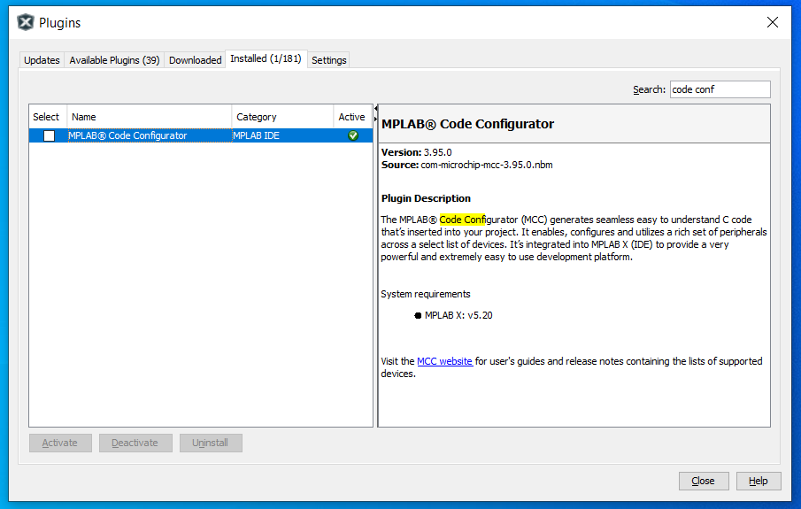
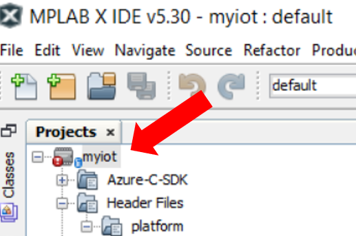
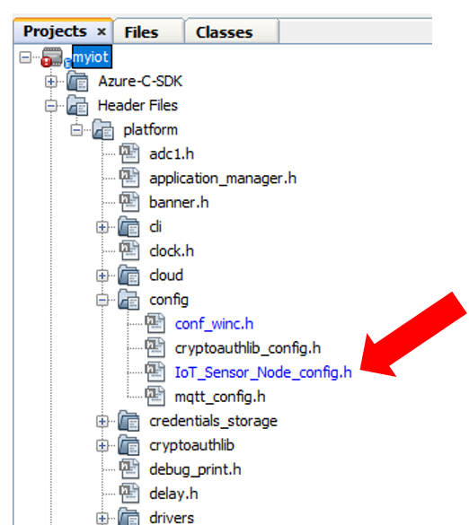
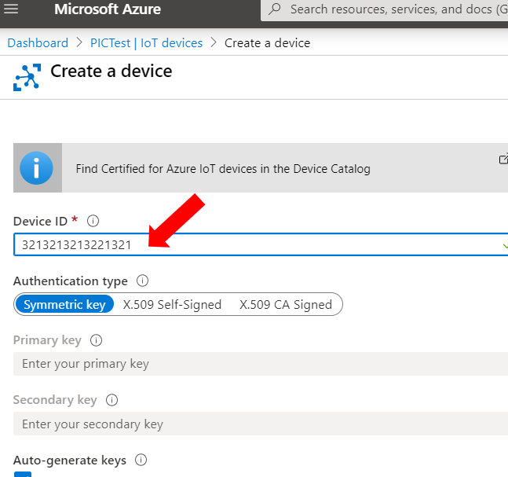
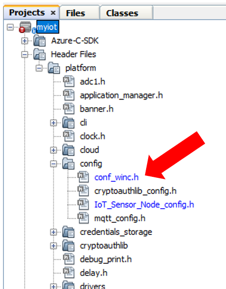
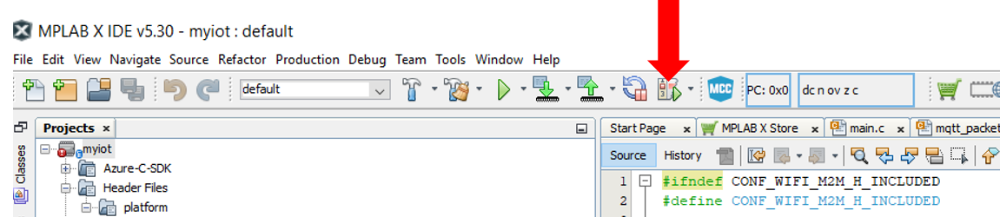
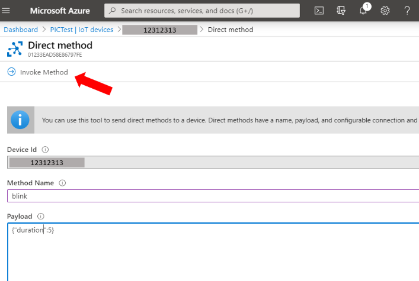

# Microchip PIC MCU16 - Azure IoT Embedded C SDK Sample Code

This page shows the steps needed to get started with the [Microchip PIC MCU16](https://www.microchip.com/developmenttools/ProductDetails/AC164164) board and get it to work with the [Azure IoT Embedded C SDK](https://github.com/Azure/azure-sdk-for-c/tree/master/sdk/iot).

## Prerequisites

Before proceeding, you should have the following ready:

-   [Setup your Azure IoT hub](https://github.com/Azure/azure-iot-device-ecosystem/blob/master/setup_iothub.md)

-   [MPLAB X IDE V5.30 or later](https://www.microchip.com/mplab/mplab-x-ide)

-   [XC16 Compiler v1.50 or later](https://www.microchip.com/mplab/compilers)

-   MPLAB code configurator (Once you finish the installation of the previous items, open MPLAB X IDE, then click Tools > Plugin Download > search for MPLAB code configurator and install it)

  

# Sample Instructions

## Get the files

1. Get the sample files from GitHub: [GitHub repo](https://github.com/ericwol-msft/Microchip-PIC-MCU16-AzureIoT)

2. Open the project in MPLAB X: File > Open Project > [select the folder in which you just downloaded the files]. The MPLAB X project name is "myiot" 

## Get the Device ID 

The device ID on both IoT hub and the device itself must match, so before creating a new device in your Iot Hub, you must retrieve your device ID. (If you're using Azure Device Provisioning Service, you don't need to worry with this step, as the device ID is automatically assigned)

- 	You can find the device id on the IoT_Sensor_Node_config.h file. 
-	To find it, on the left hand panel, look for Header files > platform > config > IoT_Sensor_Node_config.h
- Line 39 shows the #define HUB_DEVICE_ID "your_device_number"

Create a new device on your IoT Hub using this device as your device name.

  

## Update your credentials

1. Update the Wi-Fi credentials and security
- On the left hand panel, look for Header files > platform > config > config_winc.h

 

- Update your wi-fi SSID name: Line 25 shows #define CFG_MAIN_WLAN_SSID "your-ssid"
- Update your wi-fi Password:  Line 42 shows #define CFG_MAIN_WLAN_PSK "your-ssid-password"
- Update your wi-fi security: Line 36 shows #define CFG_MAIN_WLAN_AUTH M2M_WIFI_SEC_WPA_PSK (most home routers use M2M_WIFI_SEC_WPA_PSK, If this is you case, there's no need for updating this line)

2. Update the device_key and MQTT_Host  
	
- On the left hand panel, look for Header files > platform > config > IoT_Sensor_Node_config.h
- Line 44 shows the HUB_DEVICE_KEY: replace it by the Primary Key you find at your device page on the Azure Hub Portal.
- Still on this file, look at line 23 and update the CFG_MQTT_HOST information. 
- You'll need your Azure IoT Hub FQDN: 
    - On your Azure IoT Hub page, click on "Overview". 
	- Copy and save the "Hostname" value (in this example, something like: "myiothub.azure-devices.net"). 
	
## Upload the Sample to the Device

1. Once you have all the credentials set, you can upload the code to your device, by clicking on debug project.

2. If everything went well, you should see the onboard LEDs turning on. A blue LED means that the WIFI is connected. The green LED will be on when the device is connected to the hub and the yellow LED blinks every 5 seconds to confirm the telemetry has been sent to Azure. If the red LED is on, then there is an authentication error with Azure.

## Calling a direct method on the device

1. On your device window on Azure, click Direct Method
2. On the direct method window, type blink on the Method Name, type {"duration":3}  on the payload, and click "Invoke method". 
3. You should see the red LED turning on for 3 seconds and then turned back off again.

